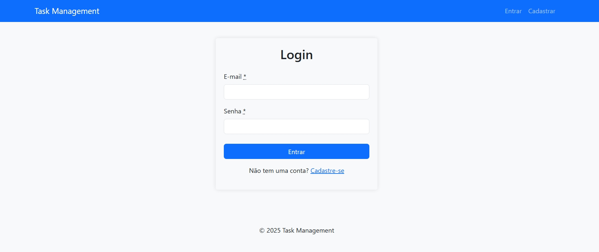
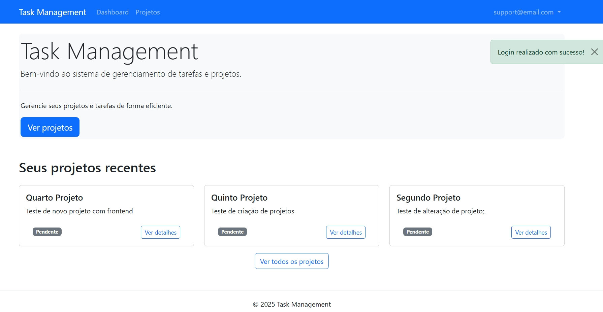
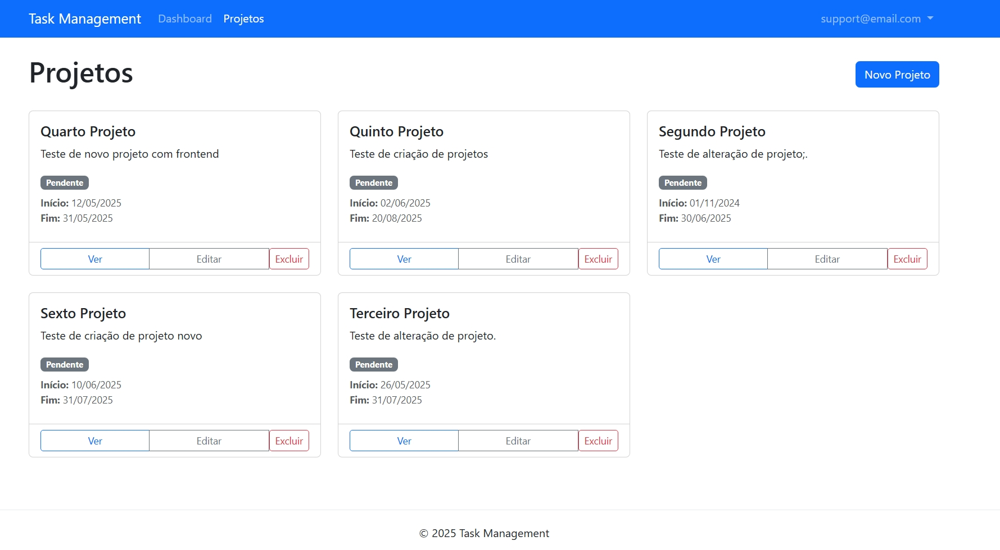
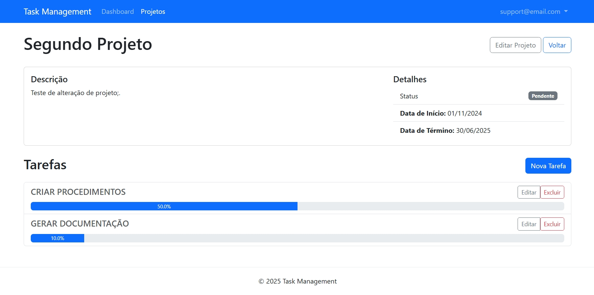
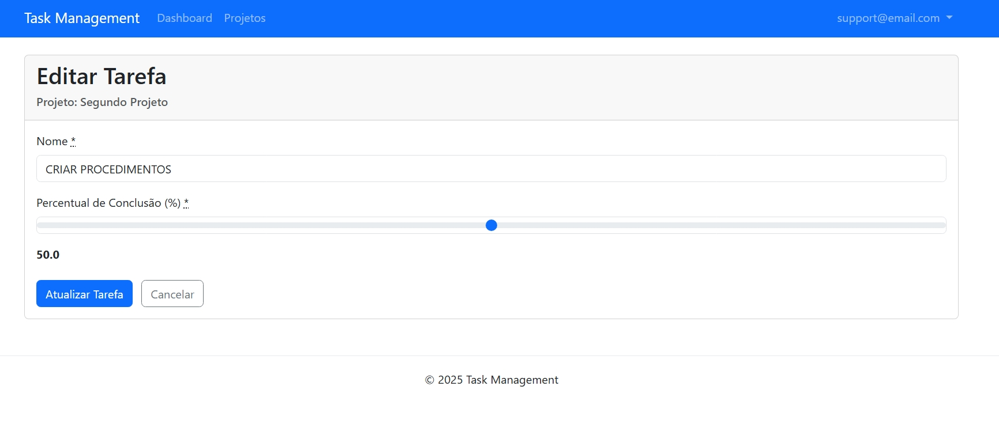

# Task Management Frontend

Uma aplicação frontend em Ruby on Rails 7 que consome uma API REST versionada de gerenciamento de tarefas e projetos.

## 📋 Sobre o Projeto

Esta aplicação serve como interface de usuário para um sistema de gerenciamento de tarefas e projetos. O backend é uma API REST versionada desenvolvida em Ruby on Rails 7, e este frontend comunica-se com ela para fornecer uma experiência de usuário completa e amigável.

### Características Principais

- **Autenticação de Usuários**: Sistema de login/cadastro com tokens JWT
- **Gerenciamento de Projetos**: CRUD completo para projetos
- **Gerenciamento de Tarefas**: CRUD completo para tarefas associadas a projetos
- **Dashboard**: Visão geral com estatísticas e acesso rápido aos projetos
- **Interface Responsiva**: Desenvolvida com Bootstrap 5.3.3
- **Compatibilidade com API Versionada**: Preparado para trabalhar com diferentes versões da API

### Algumas views

. Pagina Principal


. Dashboard


. Lista de Projetos


. Detalhes de um Projeto


. Edição de Tarefa


## 🛠️ Tecnologias Utilizadas

- **Ruby on Rails 7.2.2**: Framework de desenvolvimento web
- **Bootstrap 5.3.3**: Framework CSS para design responsivo
- **Simple Form**: Gem para criação e gerenciamento de formulários
- **HTTParty**: Biblioteca para comunicação HTTP com a API
- **JWT**: Implementação de JSON Web Tokens para autenticação
- **DotEnv-Rails**: Para variáveis de ambiente

## 🚀 Instalação e Configuração

### Pré-requisitos

- Ruby 3.3.4
- Rails 7.2.2
- Node.js e Yarn (para gerenciamento de assets)
- API Task Management em execução

### Passos para Instalação

1. Clone o repositório:

   ```bash
   git clone https://github.com/vulcanobr/task-management-frontend.git
   cd task-management-frontend
   ```

2. Instale as dependências:

   ```bash
   bundle install
   yarn install
   ```

3. Configure o arquivo de variáveis de ambiente `.env` (crie baseado no exemplo):

   ```
   API_BASE_URL=http://localhost:3000
   API_VERSION=v1
   JWT_SECRET_KEY=sua_chave_secreta_jwt
   ```

   **Importante**:

   - O `JWT_SECRET_KEY` deve ser o mesmo utilizado na API.
   - `API_VERSION` define qual versão da API será utilizada (padrão: v1)

4. Inicie o servidor:

   ```bash
   rails server -p 3001
   ```

5. Acesse a aplicação no navegador: `http://localhost:3001`

## ATENÇÃO: para o correto funcionamento, a aplicação \*\*task-management tem que estar no ar: `http://localhost:3000`

- \*\*Clone o repositório:

```bash
git clone https://github.com/vulcanobr/task-management.git
cd task-management
```

## 📚 Estrutura do Projeto

### Models e Serviços

- **Services/ApiService**: Classe base para comunicação com a API versionada
- **Services/AuthService**: Gerencia autenticação e tokens JWT
- **Services/ProjectService**: Operações CRUD para projetos
- **Services/TaskService**: Operações CRUD para tarefas

### Controllers

- **ApplicationController**: Controller base com métodos de autenticação
- **AuthController**: Gerencia login, cadastro e logout
- **DashboardController**: Controla a página inicial após login
- **ProjectsController**: CRUD para projetos
- **TasksController**: CRUD para tarefas

### Views

O projeto utiliza o layout padrão do Bootstrap com partials organizadas:

- **layouts/\_navbar.html.erb**: Barra de navegação principal
- **layouts/\_flash.html.erb**: Mensagens de feedback
- **auth/**: Views de login e registro
- **projects/**: Views para gerenciamento de projetos
- **tasks/**: Views para gerenciamento de tarefas
- **dashboard/**: View da página inicial com estatísticas

## 🔄 Fluxo da Aplicação

1. **Autenticação**:

   - Usuário se registra ou faz login
   - Sistema armazena o token JWT em sessão
   - Todas as requisições subsequentes utilizam o token

2. **Dashboard**:

   - Exibe visão geral dos projetos
   - Mostra estatísticas e tarefas pendentes

3. **Gerenciamento de Projetos**:

   - Listagem, criação, edição e exclusão de projetos
   - Visualização detalhada com tarefas associadas

4. **Gerenciamento de Tarefas**:
   - Listagem de tarefas por projeto
   - Criação, edição e exclusão de tarefas
   - Atualização do percentual de conclusão

## 📝 Uso da API Versionada

A aplicação consome os seguintes endpoints da API (com prefixo `/api/v1`):

### Autenticação

- `POST /api/v1/users/auth`: Autenticação de usuário
- `POST /api/v1/users/sign_up`: Registro de novo usuário

### Projetos

- `GET /api/v1/projects`: Lista todos os projetos
- `GET /api/v1/projects/:id`: Detalhes de um projeto específico
- `POST /api/v1/projects`: Cria novo projeto
- `PUT /api/v1/projects/:id`: Atualiza projeto existente
- `DELETE /api/v1/projects/:id`: Remove um projeto

### Tarefas

- `GET /api/v1/projects/:project_id/tasks`: Lista tarefas de um projeto
- `GET /api/v1/projects/:project_id/tasks/:id`: Detalhes de uma tarefa
- `POST /api/v1/projects/:project_id/tasks`: Cria nova tarefa
- `PUT /api/v1/projects/:project_id/tasks/:id`: Atualiza tarefa existente
- `DELETE /api/v1/projects/:project_id/tasks/:id`: Remove uma tarefa

## 🔒 Segurança

- Todas as requisições à API (exceto login e registro) incluem o token JWT no cabeçalho
- O sistema verifica a validade do token automaticamente
- Senhas são armazenadas apenas na API, nunca no frontend
- Proteção contra CSRF implementada

## 🔄 Compatibilidade com Versões da API

Esta aplicação frontend está configurada para trabalhar com a API versionada:

- Por padrão, utiliza a versão especificada na variável de ambiente `API_VERSION`
- Para alterar a versão, modifique apenas a variável no arquivo `.env`
- Suporta versionamento por URL (`/api/v1/...`)
- Opcionalmente, pode ser configurada para usar versionamento por cabeçalho HTTP

## 📈 Possíveis Melhorias Futuras

- Implementação de paginação para listas de projetos e tarefas
- Adição de gráficos mais detalhados no dashboard
- Funcionalidade de busca e filtros avançados
- Sistema de notificações em tempo real
- Compartilhamento de projetos entre usuários
- Implementação de temas/dark mode
- Exportação de relatórios
- Suporte automático a múltiplas versões da API

## 📄 Licença

Este projeto está licenciado sob a [MIT License](LICENSE).

## 📬 Contato

Para dúvidas ou sugestões, abra uma issue neste repositório ou entre em contato através de vulcanorjbr@gmail.com.

---

⭐️ Desenvolvido com Ruby on Rails 7, Bootstrap 5.3.3 e carinho! ⭐️
